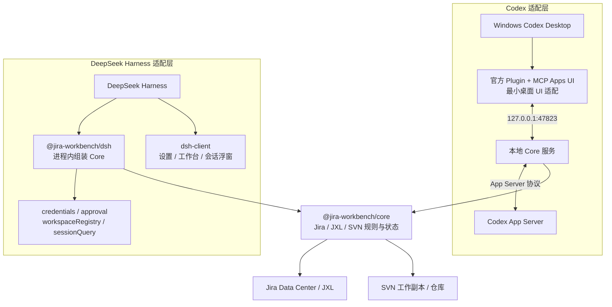

# Jira 工作台

> 当前版本：`0.33.6` 
> 运行环境：Windows Codex Desktop 或 DeepSeek Harness + Jira Data Center 
> 使用方式：个人本地运行，每位用户配置自己的 Jira PAT，数据和会话绑定彼此独立

Jira 工作台把 Jira 待办、JXL Sheets、Codex 对话和 SVN 提交连接到同一个本地工作台。它通过本机服务读取 Jira，并只在用户明确确认时提交状态流转或已审核的 SVN 改动，适合个人工作环境使用。

这不是部署在 Jira 服务器上的插件，而是一个"固定业务核 + 多宿主适配"的工具：Jira/JXL/SVN 的全部业务规则沉淀在宿主无关的 `@jira-workbench/core`，Codex 与 DeepSeek Harness 只是当前两个接入方式，各自以自己的原生扩展机制适配。

## 核心功能

- **Jira 工作台**：待我处理（需求/Bug 分栏）、处理历史、JXL Sheets 表格查看与筛选。
- **Issue 详情与附件**：父子单上下文、状态流转（实时 transitions + 一次性确认）、图片/PDF/Office 附件本地预览；DSH 文本模型会优先让新 Jira 会话使用已配置的图片模型并直接发送原图，无法安全切换时再按“视觉解析 → 本地 OCR → 明确未解析”降级，成功解析结果按附件 ID 与文件 SHA-256 复用。
- **会话与项目分别绑定**：Codex/DSH 都使用各自的原生会话目录建立一对一关联；Jira 可独立绑定一个或多个项目目录，SVN 不依赖会话存在。
- **SVN 审核与提交**：人工选择显式路径、不可变快照、可选 Codex 审查、一次性确认令牌、提交后 log 对账。
- **自动 Bug 监控（Codex）**：周期检测新 Bug、串行创建只读分析、可选企业微信推送；DSH 初版暂不挂载该后台调度器。
- **宿主隔离配置**：Codex 用 Windows DPAPI 保存密文，DSH 用自己的 credentials provider 保存引用；PAT 和企业微信 Webhook 都不会进入浏览器、会话消息或日志。

详细的能力规则、数据模型与安全边界见各包 README（下方索引）。

## 总体架构

固定业务核 + 按宿主实现的适配层。业务核稳定不变，每个宿主以自己的方式接入，互不影响；新增宿主时只加一个新的适配包，不改动业务核。

| 包 | 目录 | 角色 | 适配方式 |
| --- | --- | --- | --- |
| `@jira-workbench/core` | [`packages/core/`](packages/core/README.md) | 固定业务核：Jira/JXL/SVN 全部规则与状态，宿主能力全部构造参数注入 | 独立 MCP 服务 + `createCoreService` 组装 |
| `jira-workbench-codex` | [`packages/codex/`](packages/codex/README.md) | Codex 适配层 | 官方 Plugin/MCP Apps UI + CDP UI 注入 + installer |
| `@jira-workbench/dsh` | [`packages/dsh/`](packages/dsh/README.md) | DeepSeek Harness Host 适配层与安装入口 | 进程内 Cordis 工具 + credentials/approval |
| `@jira-workbench/dsh-client` | [`packages/dsh-client/`](packages/dsh-client/README.zh.md) | DeepSeek Harness 浏览器适配层 | 原生设置卡片 + 侧边栏入口 + 中心主工作区 + 会话摘要 |

适配层只负责"把核接到某个宿主"，不承载业务规则：

- **Codex** 用 UI 注入（侧栏工作台、会话浮窗）+ 官方 Plugin/MCP Apps 承载 Jira/SVN 能力。
- **DeepSeek Harness** 在宿主进程内组装 Core，并把工具注册到 `ctx.tools`；浏览器端只承载原生设置卡片和工作台入口。
- **其他工具**按各自的原生扩展机制接入：有 MCP 能力的直接连独立服务入口，有插件体系的写对应适配包，业务核与数据文件保持不变。

当前仓库只有一个 npm workspace 根（单一版本号），下面放一个 core 包和若干适配包；新增宿主适配时在 `packages/` 下加包即可。

## 快速开始

### 共同要求

- Jira Data Center 地址及当前用户的 Personal Access Token（PAT）。
- SVN 命令行客户端 1.8 或更高版本，并已通过当前系统用户的 SVN 凭据缓存取得目标仓库权限。
- TortoiseSVN 为可选项；未安装时仍可使用内置差异预览。
- 不要把 Codex 与 DSH 指向同一个数据目录；两个适配层默认已经隔离。

### 安装到 Codex Desktop

要求 Windows Codex Desktop、Windows PowerShell 5+、Node.js 22+ 和 npm。双击 `packages\codex\install.cmd`，或在 PowerShell 中执行：

~~~powershell
git clone https://github.com/yzj555/jira-workbench.git
cd jira-workbench
& .\packages\codex\installer\lifecycle.ps1 -Action Auto
~~~

安装完成后从桌面或开始菜单打开安装器创建的"Codex"快捷方式，在左侧栏点击"Jira 任务"，首次使用时在面板内填写 Jira 地址和 PAT 后保存连接。

> 安装器创建的"Codex"快捷方式已包含面板需要的启动参数；Microsoft Store 原始入口无法被安全修改，从原始入口启动的普通 Codex 不会加载 Jira 面板。

详细的安装、升级、卸载与发布流程见 [`packages/codex/README.md`](packages/codex/README.md)。

### 安装到 DeepSeek Harness

当前验证版本为 DeepSeek Harness `0.1.0-rc.7`。普通用户只需三步，不需要下载或解压本仓库：

1. 确认 `dsh web` 和 `pnpm` 可以正常运行。
2. 在 PowerShell 执行：

~~~powershell
dsh plugin --profile web add @jira-workbench/dsh
dsh web
~~~

3. 浏览器打开 DSH 后，在“设置 → 插件 → Jira 工作台”填写 Jira 地址和 PAT，再从侧边栏打开“Jira 工作台”。

`@jira-workbench/dsh` 会自动安装同版本的 Core 与浏览器 Client，并把 bundle patch 加入目标 profile；不需要手工修改 profile、下载 Release、复制 `cordis.patch.yml` 或创建 junction。使用 DSH 源码运行的开发者以及需要升级、卸载或离线安装的用户，参见详细手册。

DSH 的 Release 校验、源码安装、升级、卸载、数据保留和故障排查见 [`packages/dsh/INSTALL.md`](packages/dsh/INSTALL.md)。

## 本地数据与端口

| 内容 | 默认位置或地址 |
| --- | --- |
| 安装目录 | `%LOCALAPPDATA%\Programs\JiraWorkbench` |
| Codex 用户数据目录 | `%LOCALAPPDATA%\jira-workbench\`（配置、绑定、附件缓存、SVN 状态） |
| DSH 用户数据目录 | `$DSH_HOME/jira-workbench/`（credentials 引用、项目绑定、SVN 状态） |
| 面板服务 | `http://127.0.0.1:47823` |
| Codex CDP | `http://127.0.0.1:47824` |

Codex 的 Jira PAT 和企业微信 Webhook 使用 Windows DPAPI；DSH 使用自己的 credentials provider。各宿主默认使用独立数据根，避免不同密钥格式或并发写入互相覆盖。

## 开发与测试

仓库根执行全量测试（覆盖 Core、Codex、DSH，并对 DSH 浏览器端执行 TypeScript 检查和构建）：

~~~powershell
npm test
~~~

core 独立服务（宿主无关，供独立 MCP 客户端或新宿主适配；DSH 正式适配使用进程内 Core，不经过该端口）：

~~~powershell
node packages/core/bin/serve.mjs        # 默认 127.0.0.1:47823
~~~

各包的开发命令、探测与发布流程见各自 README。

## 各包文档

- [`packages/core/README.md`](packages/core/README.md) — 业务核的结构、独立服务、依赖注入约定与核心业务能力（Jira 工作台、状态流转、会话绑定、SVN 审核、自动 Bug 监控）。
- [`packages/codex/README.md`](packages/codex/README.md) — Codex 适配层：官方 Plugin 工作台、页面说明、会话浮窗、安装/升级/卸载、发布、开发运行与常见问题。
- [`packages/dsh/README.md`](packages/dsh/README.md) — DeepSeek Harness Host 适配层：进程内工具、审批、凭据、工作台和独立数据根。
- [`packages/dsh/INSTALL.md`](packages/dsh/INSTALL.md) — DSH 详细安装、升级、卸载、验证与故障排查。
- [`packages/dsh/PUBLISHING.md`](packages/dsh/PUBLISHING.md) — npm 首次发布、Trusted Publishing 配置与后续发版流程。
- [`packages/dsh-client/README.zh.md`](packages/dsh-client/README.zh.md) — DeepSeek Harness 浏览器设置、主工作区、会话入口与浮窗。

## 安全与已知限制

- Jira 写操作仅限用户二次确认的状态流转；没有修改摘要、描述、评论或附件的接口。
- SVN 是直接写入远端仓库的操作：只有审核未阻断、快照仍一致且用户人工勾选确认后才可执行；Codex 审查 turn 本身永远不会触发 commit。
- SVN commit 只接收审核快照中的显式相对路径，不会以整个工作副本 `.` 作为提交目标，也不会保存 SVN 凭据。
- 提交命令结束不等于成功：优先通过 SVN 日志唯一确认 revision，结果不明确时禁止自动重试。
- Codex 的 CDP 没有面向其他本机进程的身份认证，只应在可信设备上使用，不要将 `47823` 或 `47824` 转发到局域网或公网；DSH 适配不启动这两个端口。
- 当前产品配置固定为 Jira Data Center，不提供 Jira Cloud 切换。
- 不要把 Jira PAT 或企业微信 Webhook 粘贴到聊天、日志或仓库中。
