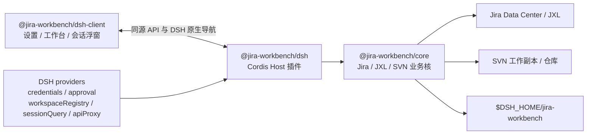

# DSH 适配设计

本文记录 Jira Workbench 在 DeepSeek Harness（DSH）中的当前架构和长期边界。运行方式、安装命令和用户可见行为分别以 [README.md](README.md)、[INSTALL.md](INSTALL.md) 和自动化测试为准。

## 1. 目标

Jira、JXL、项目绑定和 SVN 规则只实现一次，由 `@jira-workbench/core` 持有。Codex 与 DSH 负责把各自宿主的凭据、审批、会话、项目和 UI 能力注入 Core，不在适配层复制业务状态机。

DSH 适配必须满足以下约束：

1. DSH 进程内直接组装 Core，不启动第二个 Jira HTTP 业务进程。
2. Core 不 import DSH 或 Codex 的文件、对象模型和运行协议。
3. Jira PAT 使用 DSH credentials，公开配置文件只保存引用名。
4. 模型侧写操作没有 DSH approval 时不可用，不以本地确认或默认许可代替。
5. 项目目录来自 DSH workspace registry，会话来自 DSH session query，两者分别绑定。
6. Host 是业务事实来源，浏览器 Client 只负责呈现和显式用户操作。

## 2. 当前架构



### 2.1 Core

Core 提供宿主无关的服务与工具定义：Jira 查询、父子上下文、JXL Sheets、附件、状态流转、项目目录绑定、SVN 审核和提交。工具先表达为 host-agnostic definitions，再由 Codex MCP adapter 或 DSH Cordis adapter 注册；DSH 不经过 MCP 转发。

### 2.2 DSH Host

`packages/dsh/plugin.mjs` 是纯 ESM function plugin。它完成以下组装：

- 以 `$DSH_HOME/jira-workbench` 创建独立 Core data root。
- 注入 DSH credential-reference secret store 和 approval provider。
- 把 Core 工具注册到 `ctx.tools`，保留读写与开放世界安全注解。
- 从 `workspaceRegistry` 提供项目目录，从 `sessionQuery` 提供会话目录。
- 通过 `apiProxy` 创建原生会话、发送首条分析消息、读取 Skill 并跳转会话。
- 提供同源工作台路由、设置 namespace、会话关联摘要和浏览器操作接口。

### 2.3 DSH Client

`@jira-workbench/dsh-client` 注册 DSH 原生浏览器扩展点：

- `settings.plugin.item`：只显示 Jira 地址和 PAT 配置状态。
- `sidebar.footer.action`：打开中心任务工作区。
- `shell.overlay`：在中心区域承载任务首页、详情、设置、关联管理和 SVN 审核。
- 会话 header action：只在当前 DSH 会话存在 Jira 关联时显示入口，并从入口附近展开浮窗。

Client 不保存 Jira PAT、绑定 revision、审核快照或提交令牌。页面重新加载后从 Host 重新读取状态。

## 3. Provider 约定

### 3.1 `secretStore`

Core 只依赖以下业务语义：

```text
protect(key, plaintext) -> storedReferenceOrCiphertext
unprotect(key, storedValue) -> plaintext
```

- Codex/独立 Windows 服务默认使用 DPAPI 密文。
- DSH 使用 `ctx.credentials.set/resolve`，配置文件保存 `JIRA_WORKBENCH_TOKEN` 或 `JIRA_WORKBENCH_WECOM_WEBHOOK` 引用。
- `unprotect` 每次操作都重新 resolve，不跨操作缓存 PAT，确保 Token 轮换在下一次请求生效。

同一份配置文件只能由一种 secret store 解释。Codex 与 DSH 默认使用不同 data root，因此不会把 DPAPI 密文和 credential reference 混写。

### 3.2 `approvalProvider`

写操作使用两阶段 `issue/consume/revoke`：

```text
issue(action, finalPayload) -> oneTimeGrant
consume(grantId, action) -> finalPayload
revoke(grantId)
```

DSH 在 `issue` 阶段调用 `ctx.approval.request`，只有一次性批准结果才生成本地 grant。`consume` 只接受未过期、未使用且 action 一致的 grant。没有 approval 服务时，Host 不注册 14 个写工具，只保留 13 个只读工具。

面板是用户直接操作面，因此仍保留页面内参数确认；模型侧工具必须额外经过宿主 approval。两类确认不能互相替代。

### 3.3 `sessionAuditProvider`

Core 的 SVN 审查读取中性会话字段：messages、file changes、turn timestamps 和 touched files，不消费 Codex `items`、`fileChange` 或 DSH `Session.events` 原始结构。

Codex 已提供对应 reader。DSH 初版没有会话语义审查 provider，使用 null provider 并明确降级为人工审核。该降级不影响 SVN 机械检查、不可变快照、提交前复检、显式路径 commit 和日志对账。

## 4. 会话和项目目录

项目绑定和会话绑定故意分离：

| 数据 | 权威来源 | 本地映射 | 用途 |
| --- | --- | --- | --- |
| 项目目录候选 | DSH `workspaceRegistry` | `issue-workspaces.json` | 新会话工作目录、Skill 作用域、SVN 工作副本 |
| 会话候选 | DSH `sessionQuery` | `issue-bindings.json` | 打开会话、会话浮窗、Jira 与会话一对一关联 |

一个 Jira 可绑定多个项目目录，并选择一个 SVN 主目录；一个 Jira 同时只关联一个 DSH 会话。解除会话关联不会删除项目目录。两个 store 都使用 revision CAS，客户端基于旧 revision 的覆盖或删除会被拒绝。

“新建并绑定”按以下顺序执行：

1. 读取当前 Jira 父子上下文、附件、模板和所选项目 Skill；图片附件先落入当前用户缓存。
2. 通过 DSH Host 在所选项目创建正式会话。
3. 解析会话当前模型能力：支持图片则发送原图与来源；明确不支持或 Host 拒绝图片时，按配置的视觉模型、本地 OCR、明确未解析提示顺序降级。视觉/OCR 成功结果以附件 ID 与文件 SHA-256 为键缓存，失败不长期缓存。
4. 发送首条只读分析消息；Skill 可用时以 Skill 约束为准，模板补充 Jira 上下文。
5. Host 接受消息后才使用预期 revision 保存绑定。
6. 绑定成功后由 DSH 原生 session API 打开会话。

创建成功但 CAS 冲突时保留已创建会话，并明确返回“已创建但未绑定”，不会静默覆盖另一客户端的新绑定。

## 5. 工具与安全边界

DSH 当前共有 27 个工具：13 个只读工具和 14 个受审批写工具。实际清单由 Core tool definitions 生成，DSH adapter 不维护第二份工具实现。

- Jira 只提供受控状态流转，不提供修改摘要、描述、评论或附件的工具。
- SVN commit 只接受审核快照中的显式相对文件路径，不接受整个工作副本 `.`。
- 未纳管、冲突、switched、external、缺失和超限文件不会被自动修复或自动加入版本控制。
- SVN 命令结束后读取日志核对 revision；结果不明确时进入人工核对状态，禁止自动重试。
- 项目、Filter、Sheet、Skill 和会话候选都实时读取权威数据源，不在 Client 中硬编码默认 ID 或本机路径。

DSH 初版不提供 Codex 专属的自动 Bug 后台调度、企业微信自动分析推送、GitHub 自更新、App Server 或 CDP 桌面跳转。

## 6. Bundle 与安装模型

`@jira-workbench/dsh` 的 `package.json` 声明：

```json
{
  "dsh": {
    "bundle": {
      "patch": "cordis.patch.yml"
    }
  }
}
```

因此 `dsh plugin --profile web add @jira-workbench/dsh` 会在安装依赖后自动把 `@jira-workbench/dsh` 加入 `dsh.profile.bundles`。bundle patch 插入 Host 和 Client 两行；用户不需要编辑 DSH 源码或手工维护这两行。

三个 Jira Workbench 包以同一版本发布到 npm；普通用户只安装 Host，精确依赖会带上 Core 与 Client。源码开发或离线环境仍可通过同一 checkout 的三个本地 `link:` spec 安装。统一版本和完整步骤见 [INSTALL.md](INSTALL.md)。

## 7. 当前状态与后续边界

以下迁移已经完成：

- Core 工具定义与 MCP 注册解耦。
- secret store 可注入，DSH credentials 已接入。
- approval provider 两阶段化，Jira 流转和 SVN 最终提交已接入 DSH approval。
- Core 会话审查数据字段已经宿主中立化。
- 项目目录和会话绑定已经分离，并接入 DSH 原生目录服务。
- DSH 原生新建分析会话、模板/Skill、父子 Jira 上下文与图片附件链路已经接通。
- DSH Client 已提供设置、中心工作区和会话 Jira 浮窗。

明确暂缓的能力只有两类：

1. DSH 会话语义审查 provider：需要一个明确的 DSH 审查执行者和会话事件映射，当前人工审核是安全降级。
2. DSH 自动更新和后台 Bug 调度：生命周期与守护进程归 DSH 部署所有，不能复用 Codex 的 Windows updater 或后台服务。

新增能力时继续遵循本文件的宿主边界，不把 DSH `ctx.*`、Codex App Server 字段或浏览器状态写入 Core 数据模型。
